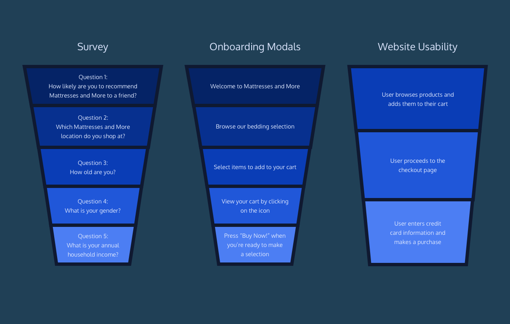

# Usage Funnels

## What is a funnel?

A **funnel** is a marketing model which illustrates the theoretical customer journey towards the purchase of a product or service. **Example**: we want to track how many users complete a series of steps and know which steps have the most number of users giving up. 



Generally, we want to know the total number of users in each step of the funnel, as well as the percent of users who complete each step. 

## Build a Funnel from a single table

On step `Survey`, not every user finished the survey! We want to build a funnel to analyze if certain questions prompted users to stop working on the survey.

 *What is the number of responses for each question?* 

```sql
SELECT question_text,
   COUNT(DISTINCT user_id)
FROM survey_responses
GROUP BY 1;
```

## Compare Funnels For A/B Tests

There is a popup to welcome new users. The company try using an A/B test where

- 50% of users view the original `control` version of the pop-ups.
- 50% of uses view the new `variant` version of the pop-ups.

*How is the funnel different between the two groups?*

``` sql
SELECT modal_text,
  COUNT(DISTINCT CASE
    WHEN ab_group = 'control' THEN user_id
    END) AS 'control_clicks',
  COUNT(DISTINCT CASE
    WHEN ab_group = 'variant' THEN user_id
    END) AS 'variant_clicks'
FROM onboarding_modals
GROUP BY 1
ORDER BY 1;
```


